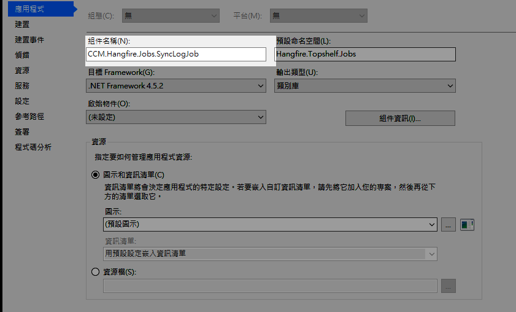

# 安裝說明

## 安裝環境需求
 
 執行該程式需要有以下二個服務 
  1. MSSQL 
  2. MSMQ  

 **檔案說明**
 1. Hangfire.Topshelf.Win.exe 主程式
 2. appsettings.json 參數設定檔
 3. recurringjob.json 任務設定檔

## 參數設定檔說明
檔名：appsettings.json
~~~ json
{
  // 服務名稱
  "hangfire.server.serviceName": "HangfireServer",
  // 服務顯示名稱
  "hangfire.server.serviceDisplayName": "Hangfire Topshelf Server",
  // 服務描述
  "hangfire.server.serviceDescription": "using topshelf to host hangfire server,processing background jobs etc.",
  // 主機位置 IP:Port
  "hangfire.server.serviceAddress": "http://192.168.100.184:9005/",
  // Web Site 位置 IP:Port
  "hangfire.server.website": "http://192.168.100.184:9005/",
  // 登入帳號
  "hangfire.login.user": "admin",
  // 登入密碼
  "hangfire.login.pwd": "abc@123",
  // 記錄檔位置
  "hangfire.logfile.path": "logs\\log-{Date}.txt",
  // MSMQ 位置
  "hangfire.MSMQ": ".\\private$\\hangfire-{0}",
  // 連線字串
  "ConnectionStrings": {
    // MSSQL 連接字串
    "hangfire.sqlserver": "Data Source=192.168.100.11;Initial Catalog=HangFireStorage;Integrated Security=False;User ID=sa;Password=6937937;Connect Timeout=15;Encrypt=False;TrustServerCertificate=True;ApplicationIntent=ReadWrite;MultiSubnetFailover=False",
    // Redis 連接字串
    "hangfire.redis": "localhost"
  }
}
~~~

## 設定檔格式
檔名： recurringjob.json
~~~ json
{
 "job-name": "Sync Log To DB",
 "job-type": "Hangfire.Topshelf.Jobs.SyncJob, CCM.Hangfire.Jobs.SyncLogJob",
 "cron-expression": "*/1 * * * *",
 "job-data": {    
      "name":"value"
    }  
}
~~~

* **job-name** : 為該任務名稱
* **job-type** : 為該任務類別 
  * 參數1為類別位置連同命名空間到類別名稱
  * 參數2為所在DLL名稱
  * 以上二個參數若有錯誤會造成程式執行錯誤
* **cron-expression** : 為執行時間格式採cron 格式
* **job-data** : 為外部傳入的參數或資料依程式需要可以自訂

## Job 開發規格
1. 建立新類別庫 (DLL)
2. 加入NuGet Package List
3. 新增Job 請新增類別檔案 (*.cs)，檔名結尾請以**Job**結尾
   1. 請先Using 相關命名空間
   2. 將類別實作介面 IRecurringJob
   3. 實作 Execute 方法
   ~~~ cs
       [DisplayName("說明")]
        public void Execute(PerformContext context)
        { 
          執行內容......
        }
   ~~~
   結果如下：
~~~ cs
using System;
using System.ComponentModel;
using Hangfire.Console;
using Hangfire.RecurringJobExtensions;
using Hangfire.Server;

namespace Hangfire.Topshelf.Jobs
{
    public class SampleJobA : IRecurringJob
    {
        [DisplayName("外掛測試使用的任務")]
        public void Execute(PerformContext context)
        {
            context.WriteLine($"{DateTime.Now:yyyy/MM/dd HH:mm:ss} SampleJobA Running ...");

            var intVal = context.GetJobData<int>("IntVal");
            var stringVal = context.GetJobData<string>("StringVal");
            var booleanVal = context.GetJobData<bool>("BooleanVal");
            var simpleObject = context.GetJobData<PamanObject>("SimpleObject");
            context.WriteLine("完成");
        }
    }
    internal class PamanObject
    {
        public string Name { get; set; }
        public int Age { get; set; }
    }
}
~~~
4. 到專案設中，變更輸出組件名稱格式為 CCM.Hangfire.Jobs.名稱。

5. 編譯後將DLL 及相關的檔案放到同一目錄下
6. 請新增recurringjob.json 中設定

### Using 部份
~~~ cs
using Hangfire.RecurringJobExtensions;
using Hangfire.Server;
using Hangfire.Console;
~~~

### Install Package 
~~~ PowerShell
Install-Package HangFire
Install-Package HangFire.Console
Install-Package Hangfire.RecurringJobExtensions
Install-Package Microsoft.Extensions.Configuration
Install-Package Microsoft.Extensions.Configuration.Json
~~~

## 主專案備忘記錄

### NuGet Package List
~~~ PowerShell
Install-Package Autofac
Install-Package Autofac.WebApi2
Install-Package HangFire
Install-Package HangFire.Autofac
Install-Package HangFire.Console
Install-Package Hangfire.Dashboard.Authorization
Install-Package Hangfire.RecurringJobExtensions
Install-Package HangFire.Redis.StackExchange
Install-Package Hangfire.SqlServer
Install-Package Hangfire.SqlServer.MSMQ
Install-Package Newtonsoft.Json
Install-Package Owin
Install-Package Serilog
Install-Package Serilog.Sinks.Literate
Install-Package Serilog.Sinks.RollingFile
Install-Package Swashbuckle 
Install-Package Topshelf
Install-Package Topshelf.Serilog
Install-Package Microsoft.AspNet.WebApi.Client
Install-Package Microsoft.AspNet.WebApi.Core
Install-Package Microsoft.AspNet.WebApi.Owin
Install-Package Microsoft.AspNet.WebApi.OwinSelfHost
Install-Package Microsoft.Extensions.Configuration
Install-Package Microsoft.Extensions.Configuration.Json
Install-Package Microsoft.Bcl
Install-Package Microsoft.Bcl.Build
~~~