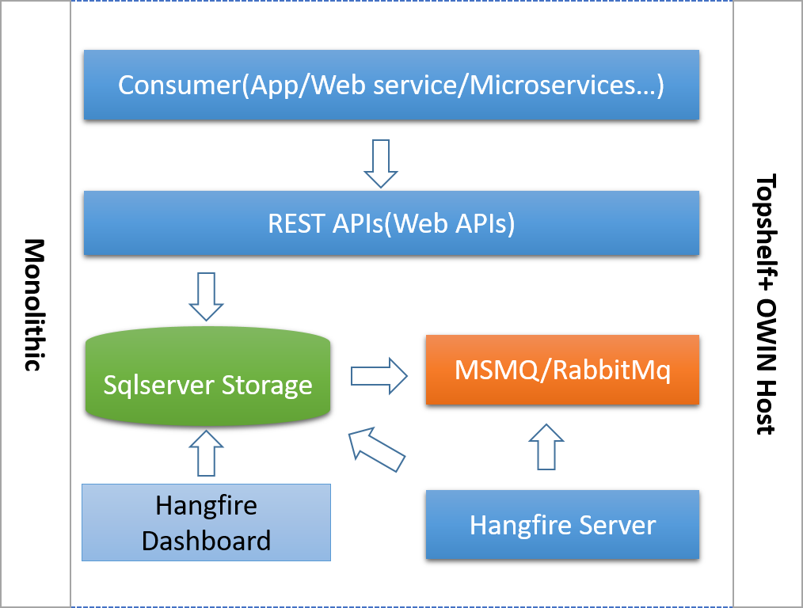
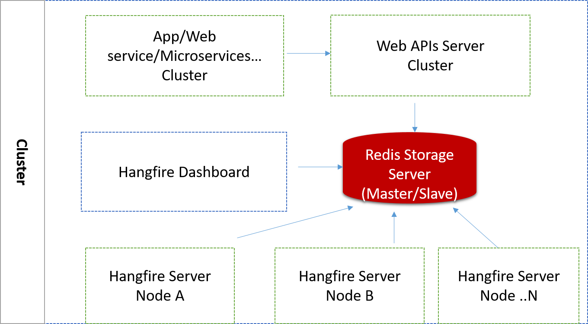

# Hangfire.Topshelf

[](https://ci.appveyor.com/project/icsharp/hangfire-topshelf)

To initialize this repo, you need to run git command `git submodule update --init --recursive` after you clone the master repo.

Samples as below:

## Host [Hangfire](https://github.com/HangfireIO/Hangfire) server in windows service using [Topshelf](https://github.com/Topshelf/Topshelf)

- Impl interface `ServiceControl` based on `OWIN`.

```csharp
/// <summary>
/// OWIN host
/// </summary>
public class Bootstrap : ServiceControl
{
    private readonly LogWriter _logger = HostLogger.Get(typeof(Bootstrap));
    private IDisposable webApp;
    public string Address { get; set; }
    public bool Start(HostControl hostControl)
    {
        try
        {
            webApp = WebApp.Start<Startup>(Address);
            return true;
        }
        catch (Exception ex)
        {
            _logger.Error($"Topshelf starting occured errors:{ex.ToString()}");
            return false;
        }

    }

    public bool Stop(HostControl hostControl)
    {
        try
        {
            webApp?.Dispose();
            return true;
        }
        catch (Exception ex)
        {
            _logger.Error($"Topshelf stopping occured errors:{ex.ToString()}");
            return false;
        }

    }
}
```

- Extension method `UseOwin`

``` csharp
public static HostConfigurator UseOwin(this HostConfigurator configurator, string baseAddress)
{
    if (string.IsNullOrEmpty(baseAddress)) throw new ArgumentNullException(nameof(baseAddress));

    configurator.Service(() => new Bootstrap { Address = baseAddress });

    return configurator;
}
```

- Start windows service

```csharp
static int Main(string[] args)
{
    log4net.Config.XmlConfigurator.Configure();

    return (int)HostFactory.Run(x =>
    {
        x.RunAsLocalSystem();

        x.SetServiceName(HangfireSettings.ServiceName);
        x.SetDisplayName(HangfireSettings.ServiceDisplayName);
        x.SetDescription(HangfireSettings.ServiceDescription);

        x.UseOwin(baseAddress: HangfireSettings.ServiceAddress);

        x.SetStartTimeout(TimeSpan.FromMinutes(5));
        //https://github.com/Topshelf/Topshelf/issues/165
        x.SetStopTimeout(TimeSpan.FromMinutes(35));

        x.EnableServiceRecovery(r => { r.RestartService(1); });
    });
}

```

## Using IoC with [Autofac](https://github.com/autofac/Autofac)

- Register components using `Autofac.Module`

```csharp
/// <summary>
/// Hangfire Module
/// </summary>
public class HangfireModule : Autofac.Module
{
    protected override void AttachToComponentRegistration(IComponentRegistry componentRegistry, IComponentRegistration registration)
    {
        base.AttachToComponentRegistration(componentRegistry, registration);

        // Handle constructor parameters.
        registration.Preparing += OnComponentPreparing;

        // Handle properties.
        registration.Activated += (sender, e) => InjectLoggerProperties(e.Instance);
    }

    private void InjectLoggerProperties(object instance)
    {
        var instanceType = instance.GetType();

        // Get all the injectable properties to set.
        // If you wanted to ensure the properties were only UNSET properties,
        // here's where you'd do it.
        var properties = instanceType
            .GetProperties(BindingFlags.Public | BindingFlags.Instance)
            .Where(p => p.PropertyType == typeof(ILog) && p.CanWrite && p.GetIndexParameters().Length == 0);

        // Set the properties located.
        foreach (var propToSet in properties)
        {
            propToSet.SetValue(instance, LogProvider.GetLogger(instanceType), null);
        }
    }

    private void OnComponentPreparing(object sender, PreparingEventArgs e)
    {
        e.Parameters = e.Parameters.Union(new[]
                {
                new ResolvedParameter(
                    (p, i) => p.ParameterType == typeof(ILog),
                    (p, i) => LogProvider.GetLogger(p.Member.DeclaringType)
                ),
                });
    }

    /// <summary>
    /// Auto register
    /// </summary>
    /// <param name="builder"></param>
    protected override void Load(ContainerBuilder builder)
    {
        //register all implemented interfaces
        builder.RegisterAssemblyTypes(ThisAssembly)
            .Where(t => typeof(IDependency).IsAssignableFrom(t) && t != typeof(IDependency) && !t.IsInterface)
            .AsImplementedInterfaces();

        //register speicified types here
        builder.Register(x => new RecurringJobService());
    }
}
```

- Extension method `UseAutofac`

```csharp
public static IContainer UseAutofac(this IAppBuilder app, HttpConfiguration config)
{
    if (config == null) throw new ArgumentNullException(nameof(config));

    var builder = new ContainerBuilder();

    var assembly = typeof(Startup).Assembly;

    builder.RegisterAssemblyModules(assembly);

    builder.RegisterApiControllers(assembly);

    var container = builder.Build();

    config.DependencyResolver = new AutofacWebApiDependencyResolver(container);

    GlobalConfiguration.Configuration.UseAutofacActivator(container);

    return container;
}
```

## Register `RecurringJob` automatically

- Usage

```csharp
public class RecurringJobService
{
    [RecurringJob("*/1 * * * *")]
    [DisplayName("InstanceTestJob")]
    [Queue("jobs")]
    public void InstanceTestJob(PerformContext context)
    {
        context.WriteLine($"{DateTime.Now.ToString("yyyy/MM/dd HH:mm:ss")} InstanceTestJob Running ...");
    }

    [RecurringJob("*/5 * * * *")]
    [DisplayName("JobStaticTest")]
    [Queue("jobs")]
    public static void StaticTestJob(PerformContext context)
    {
        context.WriteLine($"{DateTime.Now.ToString("yyyy/MM/dd HH:mm:ss")} StaticTestJob Running ...");
    }
}

public interface ISampleService : IAppService
{
    /// <summary>
    /// simple job test
    /// </summary>
    /// <param name="context"></param>
    [RecurringJob("0 4 1 * *")]
    [AutomaticRetry(Attempts = 3)]
    [DisplayName("SimpleJobTest")]
    [Queue("jobs")]
    void SimpleJob(PerformContext context);
}

```

In app start, using extension method `UseRecurringJob` to assign the types targeted by `RecurringJobAttribute`:

`GlobalConfiguration.Configuration.UseRecurringJob(typeof(RecurringJobService), typeof(ISampleService))`

## Architecture

### Monolithic



### Cluster




